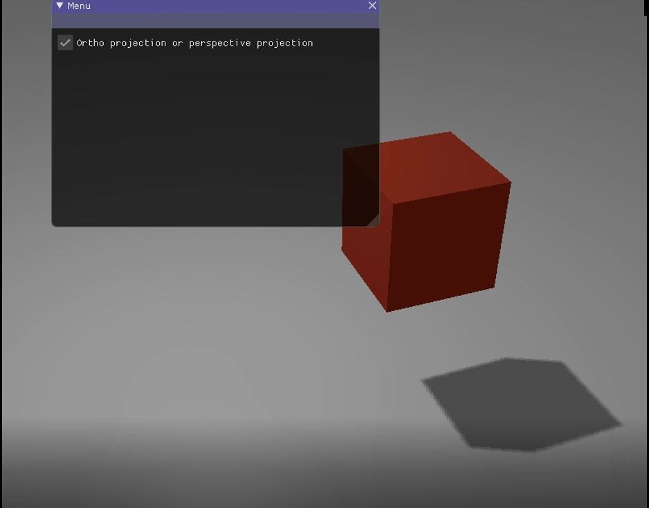
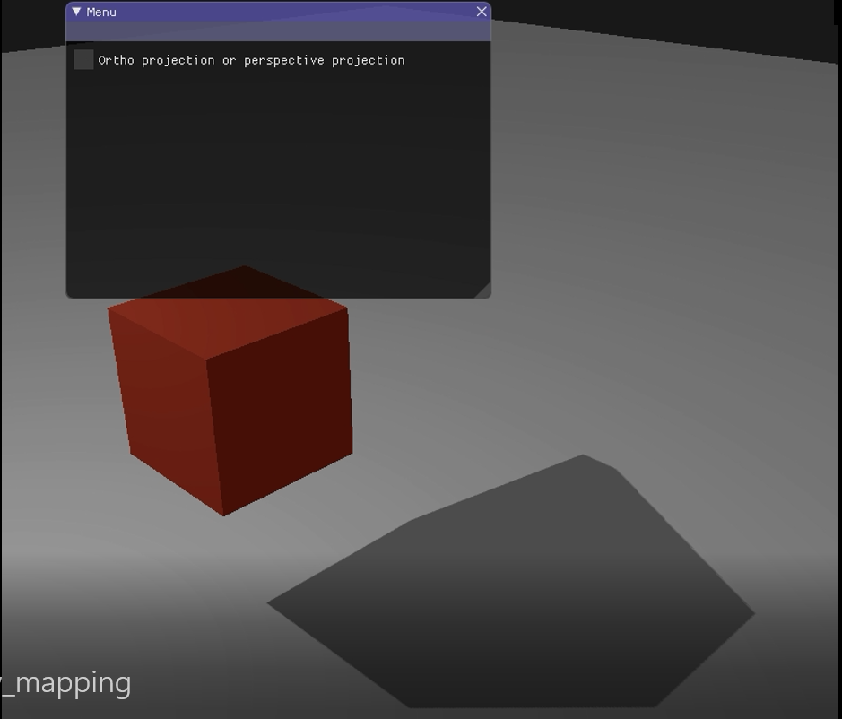

# 计算机图形学第七次作业

```
姓名：刘俊峰
学号：16340150
```
## 要求
### Basic: 
1. 实现方向光源的Shadowing Mapping: 要求场景中至少有一个object和一块平面(用于显示shadow) 光源的投影方式任选其一即可 
2. 在报告里结合代码，解释Shadowing Mapping算法 
3. 修改GUI
### Bonus: 
1. 实现光源在正交/透视两种投影下的Shadowing Mapping 
2. 优化Shadowing Mapping (可结合References链接，或其他方法。优化方式越多越好，在报告里说明，有加分) 

## 实验步骤
### shadow mapping的实现
shadow mapping的思路很简单，就是将照相机转动到光源的位置进行渲染，这样我们就可以得到一个渲染成功的图片。根据这张图片的遮挡关系我们就可以得到阴影的位置，最后在正常视角下将这个位置的光照（漫反射和镜面反射）值设为0.

#### 1. 生成一张深度贴图
创建一个深度缓冲和一个之后要用到的2D纹理
```cpp
GLuint depthMapFBO;
glGenFramebuffers(1, &depthMapFBO);
const GLuint SHADOW_WIDTH = 1024, SHADOW_HEIGHT = 1024;

GLuint depthMap;
glGenTextures(1, &depthMap);
glBindTexture(GL_TEXTURE_2D, depthMap);
glTexImage2D(GL_TEXTURE_2D, 0, GL_DEPTH_COMPONENT, 
             SHADOW_WIDTH, SHADOW_HEIGHT, 0, GL_DEPTH_COMPONENT, GL_FLOAT, NULL);
glTexParameteri(GL_TEXTURE_2D, GL_TEXTURE_MIN_FILTER, GL_NEAREST);
glTexParameteri(GL_TEXTURE_2D, GL_TEXTURE_MAG_FILTER, GL_NEAREST);
glTexParameteri(GL_TEXTURE_2D, GL_TEXTURE_WRAP_S, GL_REPEAT); 
glTexParameteri(GL_TEXTURE_2D, GL_TEXTURE_WRAP_T, GL_REPEAT);
```
生成深度贴图不太复杂。因为我们只关心深度值，我们要把纹理格式指定为GL_DEPTH_COMPONENT。我们还要把纹理的高宽设置为1024：这是深度贴图的解析度。然后将生成的深度纹理作为帧缓冲的深度缓冲：
```cpp
glBindFramebuffer(GL_FRAMEBUFFER, depthMapFBO);
glFramebufferTexture2D(GL_FRAMEBUFFER, GL_DEPTH_ATTACHMENT, GL_TEXTURE_2D, depthMap, 0);
glDrawBuffer(GL_NONE);
glReadBuffer(GL_NONE);
glBindFramebuffer(GL_FRAMEBUFFER, 0);
```
这里我们可以注意到，glDraw和glRead的颜色值都设为了空。因为我们不需要进行颜色渲染，只需要获得深度信息。将深度值渲染到纹理的帧缓冲之后，我们就可以开始生成贴图了。
```cpp
glViewport(0, 0, SHADOW_WIDTH, SHADOW_HEIGHT);
glBindFramebuffer(GL_FRAMEBUFFER, depthMapFBO);
    glClear(GL_DEPTH_BUFFER_BIT);
    ConfigureShaderAndMatrices();
    RenderScene();
glBindFramebuffer(GL_FRAMEBUFFER, 0);
glViewport(0, 0, SCR_WIDTH, SCR_HEIGHT);
glClear(GL_COLOR_BUFFER_BIT | GL_DEPTH_BUFFER_BIT);
ConfigureShaderAndMatrices();
glBindTexture(GL_TEXTURE_2D, depthMap);
RenderScene(); // 之前我们常用的渲染方法。
```
在RenderScene中，我们还需要设置之前我们经常设置的view、 model、projection矩阵。view就是光源作为camera，这个不需要多说。projection和之前一样有两种形式，正交/透视。model即光源的位置。
```glsl
#version 330 core
layout (location = 0) in vec3 position;

uniform mat4 lightSpaceMatrix;
uniform mat4 model;

void main()
{
    gl_Position = lightSpaceMatrix * model * vec4(position, 1.0f);
}
```
这里的lightSpaceMatrix是view和projection点乘的结果。

这样，深度贴图就完成了。我们会将他保存成一个2d的纹理。

#### 2. 渲染场景
渲染方法和之前并没有区别。但是在片段着色器渲染光照的时候，我们会判断这个位置是否是阴影。方法是：将当前坐标转换为光源坐标系下的坐标，然后判断2d纹理贴图这个位置的值（是一个深度值），如果这个深度值比当前深度值（也要投影到光源坐标系）要大，说明这个位置没有被遮挡。反之，则这个位置被遮挡。
```glsl
float ShadowCalculation(vec4 fragPosLightSpace) {
    // 执行透视除法
    vec3 projCoords = fragPosLightSpace.xyz / fragPosLightSpace.w;
    // 变换到[0,1]的范围
    projCoords = projCoords * 0.5 + 0.5;
    // 取得最近点的深度(使用[0,1]范围下的fragPosLight当坐标)
    float closestDepth = texture(shadowMap, projCoords.xy).r; 
    // 取得当前片元在光源视角下的深度
    float currentDepth = projCoords.z;
    // 检查当前片元是否在阴影中
    float shadow = currentDepth > closestDepth  ? 1.0 : 0.0;

    return shadow;
}
// main
vec3 lighting = (ambient + (1.0 - shadow) * (diffuse + specular)) * color;    
```
进行到这里，shadow mapping基本就完成了。

### Bonus：正交投影和透视投影
```cpp
if (orthoOrPer)
	lightProjection = glm::ortho(-10.0f, 10.0f, -10.0f, 10.0f, near_plane, far_plane);
else
	lightProjection = glm::perspective(glm::radians(45.0f), (GLfloat)SHADOW_WIDTH / (GLfloat)SHADOW_HEIGHT, near_plane, far_plane);
```

### Bonus：shadow mapping 的优化
这次作业里一共用了三种优化：阴影偏移、解决采样过多、PCF。

阴影偏移用来解决阴影失真的问题：我们简单的对表面的深度（或深度贴图）应用一个偏移量，这样片元就不会被错误地认为在表面之下了。使用了偏移量后，所有采样点都获得了比表面深度更小的深度值，这样整个表面就正确地被照亮，没有任何阴影。我们可以这样实现这个偏移：
```glsl
float bias = 0.005;
float shadow = currentDepth - bias > closestDepth  ? 1.0 : 0.0;
```
一个0.005的偏移就能帮到很大的忙，但是有些表面坡度很大，仍然会产生阴影失真。有一个更加可靠的办法能够根据表面朝向光线的角度更改偏移量：使用点乘：
```glsl
float bias = max(0.05 * (1.0 - dot(normal, lightDir)), 0.005);
```

解决采样过多：无论你喜不喜欢还有一个视觉差异，就是光的视锥不可见的区域一律被认为是处于阴影中，不管它真的处于阴影之中。出现这个状况是因为超出光的视锥的投影坐标比1.0大，这样采样的深度纹理就会超出他默认的0到1的范围。根据纹理环绕方式，我们将会得到不正确的深度结果，它不是基于真实的来自光源的深度值。

简单的说，这样会在某些没有被遮挡的平面上投下阴影。我们可以设置超出贴图范围的地方设置为没有阴影。

PCF：用来解决阴影边缘处的锯齿状。它的原理很简单，只是对某一个像素周围进行了加权平均。这样，算出来的边缘就会有一定的模糊效果。
```glsl
for(int x = -1; x <= 1; ++x) {
    for(int y = -1; y <= 1; ++y) {
        float pcfDepth = texture(shadowMap, projCoords.xy + vec2(x, y) * texelSize).r; 
        shadow += currentDepth - bias > pcfDepth  ? 1.0 : 0.0;        
    }    
}
shadow /= 9.0;
```

## 实验截图




